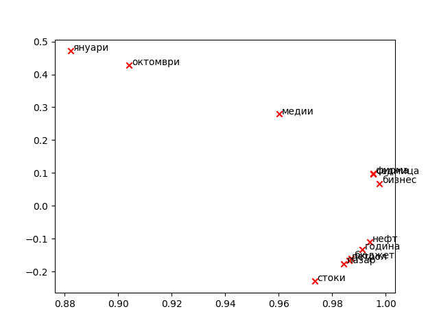

# Word2Vec Skip-gram with Negative Sampling and Quadratic Form

## Implementation of a Modified Word2Vec Model for Bulgarian Language

**Author:** Georgi H. Lazov
**Student ID:** 0MI0600299
**Course:** Information Retrieval and Deep Learning
**Instructor:** Prof. Stoyan Mihov
**Semester:** Winter 2025/2026

---

## Abstract

This work presents an implementation of a modified Word2Vec Skip-gram model with negative sampling for training word embeddings on a corpus of Bulgarian journalistic texts. The key modification compared to standard Word2Vec is the introduction of a matrix W as a quadratic form parameter in the model. Functions for computing loss and gradients are implemented for both single observations and batch processing using tensor operations. The results demonstrate successful clustering of semantically related words in two-dimensional space.

**Keywords:** Word2Vec, Skip-gram, Negative Sampling, Word Embeddings, Natural Language Processing, Bulgarian Language

---

## 1. Introduction

### 1.1 Motivation

Word embeddings are a fundamental component in modern natural language processing. They represent words as dense vectors in a continuous space, where semantically similar words are positioned close to each other.

### 1.2 Project Objectives

1. Implement sampling functions with negative examples
2. Compute loss function and gradients for a modified Skip-gram model
3. Optimize batch gradient computation using tensor operations
4. Implement stochastic gradient descent (SGD)
5. Train the model on a Bulgarian text corpus

### 1.3 Corpus Used

The model was trained on the **Corpus of Journalistic Texts for Southeastern Europe**, provided by the Institute for Bulgarian Language at the Bulgarian Academy of Sciences:
- **Number of documents:** 35,337
- **Size:** 7.9 MB
- **Language:** Bulgarian
- **Source:** http://dcl.bas.bg/BulNC-registration/

---

## 2. Theoretical Background

### 2.1 Word2Vec Skip-gram Model

The Word2Vec Skip-gram model aims to predict context words given a target word. For each pair (target word w, context word c), the model learns two embedding matrices:
- **U** — embedding matrix for target words (dimension V × M)
- **V** — embedding matrix for context words (dimension V × M)

where V is the vocabulary size and M is the embedding dimension.

### 2.2 Quadratic Form Modification

In this implementation, an additional matrix **W** (dimension M × M) is introduced as a quadratic form parameter:

$$t = v_c \cdot (W \cdot u_w) - q$$

where:
- $u_w$ is the target word embedding
- $v_c$ is the context word embedding
- $W$ is the quadratic form matrix
- $q$ is the log probability for negative sampling

### 2.3 Negative Sampling

Negative sampling is a technique for approximating the softmax function that significantly speeds up training. Instead of computing probability over the entire vocabulary, n negative examples are selected with probability:

$$P(w) \propto f(w)^{0.75}$$

where $f(w)$ is the word frequency in the corpus.

### 2.4 Loss Function

The loss function for a single observation is binary cross-entropy:

$$J = -\sum_{i} \left[ \delta_i \log(\sigma(t_i)) + (1-\delta_i) \log(1-\sigma(t_i)) \right]$$

where:
- $\sigma(x) = \frac{1}{1+e^{-x}}$ is the sigmoid function
- $\delta_i = 1$ for the positive example (i=0), $\delta_i = 0$ for negative examples

---

## 3. Implementation

### 3.1 Sampling Functions (`sampling.py`)

#### 3.1.1 createSamplingSequence

Creates a sampling sequence where each word index appears proportionally to $f(w)^{0.75}$:

```python
def createSamplingSequence(freqs):
    seq = []
    for i, freq in enumerate(freqs):
        count = round(freq ** 0.75)
        seq.extend([i] * count)
    return seq
```

**Complexity:** O(V × average frequency^0.75)

#### 3.1.2 noiseDistribution

Computes the log probabilities for negative sampling:

```python
def noiseDistribution(freqs, negativesCount):
    freqs_adjusted = np.round(np.array(freqs) ** 0.75)
    probs = freqs_adjusted / np.sum(freqs_adjusted)
    q_noise = np.log(probs * negativesCount)
    return q_noise
```

### 3.2 Gradient Computation (`grads.py`)

#### 3.2.1 lossAndGradient (Single Observation)

Computes loss and gradients for a single observation:

```python
def lossAndGradient(u_w, Vt, W, q):
    t = Vt @ (W @ u_w) - q
    sigma_t = sigmoid(t)

    delta_c = np.zeros_like(q)
    delta_c[0] = 1.0

    J = -np.sum(delta_c * np.log(sigma_t) +
                (1 - delta_c) * np.log(1 - sigma_t))

    diff = sigma_t - delta_c

    du_w = W.T @ (Vt.T @ diff)
    dVt = diff[:, np.newaxis] @ (u_w[np.newaxis, :] @ W.T)
    dW = (Vt.T @ diff[:, np.newaxis]) @ u_w[np.newaxis, :]

    return J, du_w, dVt, dW
```

**Gradients:**
- $\frac{\partial J}{\partial u_w} = W^T V^T (\sigma(t) - \delta)$
- $\frac{\partial J}{\partial V} = (\sigma(t) - \delta) \cdot (u_w W^T)$
- $\frac{\partial J}{\partial W} = V^T (\sigma(t) - \delta) \cdot u_w^T$

#### 3.2.2 lossAndGradientBatched (Batch Processing)

Optimized version using tensor operations for processing S observations simultaneously:

```python
def lossAndGradientBatched(u_w, Vt, W, q):
    S, M = u_w.shape

    W_u = u_w @ W.T
    t = np.einsum('snm,sm->sn', Vt, W_u) - q

    sigma_t = sigmoid(t)

    delta_c = np.zeros_like(q)
    delta_c[:, 0] = 1.0

    allJ = -np.sum(delta_c * np.log(sigma_t) +
                   (1 - delta_c) * np.log(1 - sigma_t))
    J = np.sum(allJ) / S

    diff_S = (sigma_t - delta_c) / S

    du_w = np.einsum('snm,sn->sm', Vt, diff_S) @ W
    dVt = np.einsum('sn,sm->snm', diff_S, u_w @ W.T)
    dW = np.einsum('snm,sn,sk->mk', Vt, diff_S, u_w)

    return J, du_w, dVt, dW
```

**Key Optimizations:**
- Use of `np.einsum` for efficient tensor contractions
- Avoidance of explicit loops
- Vectorized operations for the entire batch

### 3.3 Stochastic Gradient Descent (`w2v_sgd.py`)

```python
def stochasticGradientDescend(data, U0, V0, W0, contextFunction,
                               lossAndGradientFunction, q_noise,
                               batchSize=1000, epochs=1, alpha=1.):
    U, V, W = U0, V0, W0
    idx = np.arange(len(data))

    for epoch in range(epochs):
        np.random.shuffle(idx)
        for b in range(0, len(idx), batchSize):
            # Prepare batch
            batchData = [(w, contextFunction(c))
                         for w, c in data[idx[b:b+batchSize]]]

            # Compute gradients
            J, du_w, dVt, dW = lossAndGradientFunction(u_w, Vt, W, q)

            # Update parameters
            W -= alpha * dW
            for k, (w, context) in enumerate(batchData):
                U[w] -= alpha * du_w[k]
                V[context] -= alpha * dVt[k]

    return U, V, W
```

---

## 4. Model Parameters

| Parameter | Value | Description |
|-----------|-------|-------------|
| embDim | 50 | Embedding dimension |
| windowSize | 3 | Context window size |
| negativesCount | 5 | Number of negative samples |
| batchSize | 1000 | Batch size |
| epochs | 1 | Number of epochs |
| alpha | 1.0 | Learning rate |
| vocabularySize | 20,000 | Vocabulary size |

---

## 5. Results

### 5.1 Embedding Visualization

After training, embeddings were reduced to 2D using SVD and normalized. The figure below shows the arrangement of selected words:



### 5.2 Semantic Clustering

The visualization demonstrates successful semantic clustering:

**Group 1: Temporal Concepts**
- "януари" (January), "октомври" (October) — months, clustered in the upper left

**Group 2: Economic Terms**
- "пазар" (market), "стоки" (goods), "бизнес" (business), "фирма" (company), "бюджет" (budget) — economic concepts, clustered in the lower right

**Group 3: Energy Resources**
- "петрол" (petroleum), "нефт" (oil) — synonyms, positioned close to each other

### 5.3 Performance

The batched version (`lossAndGradientBatched`) achieves **over 2x faster execution** compared to the cumulative version due to:
- Vectorized tensor operations
- Efficient use of `numpy` and `einsum`
- Avoidance of Python loops

---

## 6. Tests

All implemented functions were validated through the provided tests:

| Test | Function | Result |
|------|----------|--------|
| test 3 | createSamplingSequence | ✓ Passed |
| test 3 | noiseDistribution | ✓ Passed |
| test 4 | lossAndGradient | ✓ Passed |
| test 5 | lossAndGradientBatched | ✓ Passed |
| test 6 | stochasticGradientDescend | ✓ Passed |

---

## 7. Conclusions

### 7.1 Achieved Results

1. **Successful implementation** of a modified Word2Vec Skip-gram model with quadratic form
2. **Efficient batch computation** of gradients using tensor operations
3. **Semantically meaningful embeddings** for Bulgarian language
4. **Validation** through all provided tests

### 7.2 Future Work

- Increase embedding dimension (100-300)
- Experiment with different negativesCount values
- Apply learning rate scheduling
- Evaluate using word analogy tasks

---

## 8. Technical Details

### 8.1 Requirements

```
Python >= 3.5
numpy
nltk
matplotlib
scikit-learn
```

### 8.2 Project Structure

```
HW2/
├── README.md                 # This document
├── Tasks_1_and_2.pdf        # Theoretical tasks
├── a2/
│   ├── grads.py             # Loss and gradient functions
│   ├── sampling.py          # Sampling functions
│   ├── w2v_sgd.py           # SGD implementation
│   ├── utils.py             # Utility functions
│   ├── run.py               # Main training script
│   ├── test.py              # Tests
│   ├── w2v-U.npy            # Trained U matrix
│   ├── w2v-V.npy            # Trained V matrix
│   ├── w2v-W.npy            # Trained W matrix
│   └── embeddings.png       # Visualization
└── FN0MI0600299/            # Final submission version
```

### 8.3 Execution

```bash
# Create and activate virtual environment (first time only)
cd HW2
python3 -m venv venv
source venv/bin/activate
pip install numpy matplotlib scikit-learn nltk

# Navigate to working directory
cd a2

# Run with batched gradients (default)
python run.py

# Run with cumulative gradients
python run.py cumulative

# Run tests
python test.py 3  # Test sampling functions
python test.py 4  # Test lossAndGradient
python test.py 5  # Test lossAndGradientBatched
python test.py 6  # Test SGD
```

---

## References

1. Mikolov, T., et al. (2013). *Efficient Estimation of Word Representations in Vector Space*. arXiv:1301.3781
2. Mikolov, T., et al. (2013). *Distributed Representations of Words and Phrases and their Compositionality*. NIPS 2013
3. Goldberg, Y., & Levy, O. (2014). *word2vec Explained: Deriving Mikolov et al.'s Negative-Sampling Word-Embedding Method*. arXiv:1402.3722
4. Corpus of Journalistic Texts for Southeastern Europe, Institute for Bulgarian Language, Bulgarian Academy of Sciences

---

*This document was created as part of Homework Assignment 2 for the course "Information Retrieval and Deep Learning", Faculty of Mathematics and Informatics, Sofia University "St. Kliment Ohridski", 2025/2026*